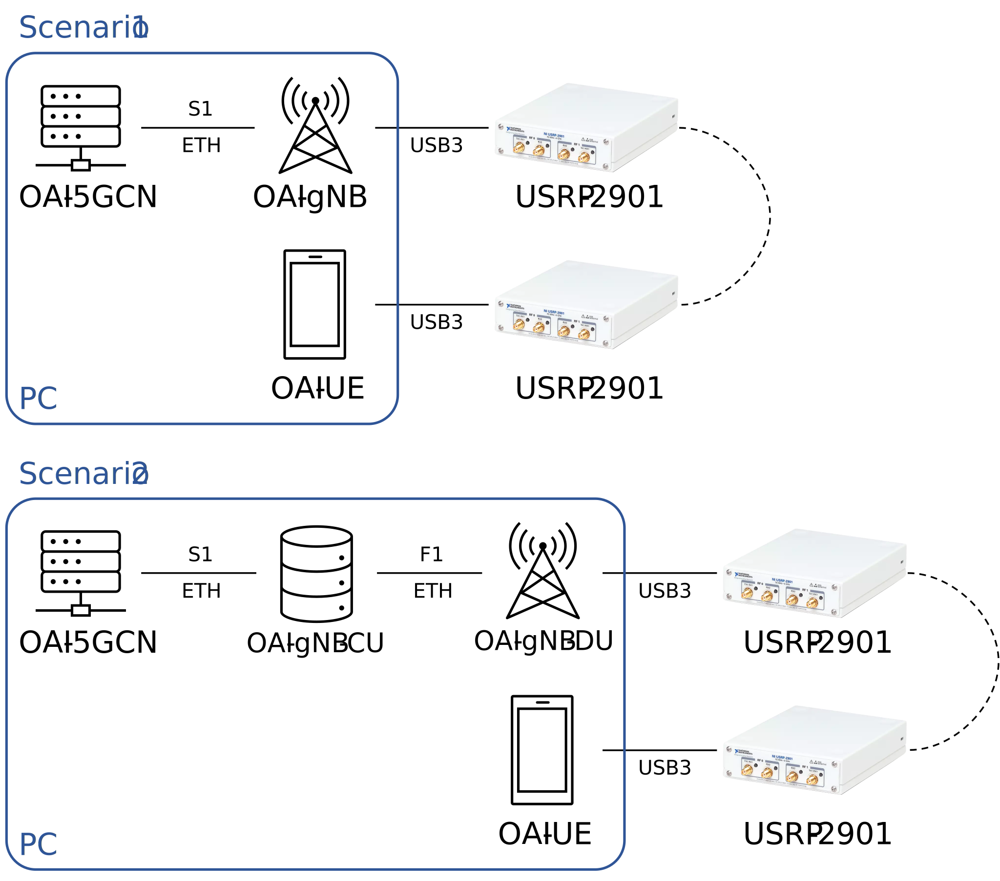

# 5G Stand Alone Enviroment using Open Air Interface

Uma breve descrição sobre o que esse projeto faz e para quem ele é

**This tutorial is based on 5G_SA... tutorial available on Open Air Interface repository.**

## 1. Scenario

The setup described in this tutorial was done in a single PC, running the OAI-5GCN, OAI-gNB and OAI-UE. Three scenarios are considered
    1. Monolithic gNB
    2. CU/DU split
    3. CU/DU split with CU running in a virtual machine



- PC configurations
    - OS: Ubuntu 20.04
    - Processor: Intel i7 12XX (n cores X GHz)
    - Memory: 16 GB DDR4 XX MHz
    - Storage: 512 GB NVMe 4
- OAI-5GCN
    - Branch: v1.4.0
    - Basic run
- OAI-gNB
    - Branch develop
    - Tag: 0xXX
    - Band: n78
    - Bandwidth: 40 MHz (106 PRBs)
    - USRP: National Instruments USRP-2901 (Ettus B210)
    - Antenna: Wideband (600 MHz to 6 GHz) SMA antenna
- OAI-UE
    - Branch develop
    - Commit: 0xXX
    - Band: n78
    - Bandwidth: 40 MHz (106 PRBs)
    - USRP: National Instruments USRP-2901 (Ettus B210)
    - Antenna: Wideband (600 MHz to 6 GHz) SMA antenna
    - IMSI: 208990000007487
    - Key: fec86ba6eb707ed08905757b1bb44b8f
    - OpcKey: C42449363BBAD02B66D16BC975D77CC1
- Common configuration
    - MCC (Mobile Country Code): 208
    - MNC (Mobile Network Code): 99
    - TAC (Tracking Area Code): 0x01
    - SST (Slice/Service Type): 0x01
    - SD (Slice Diferentiator): 0x01

## 2. OAI-5GCN

### 2.1. Installing the pre-requisites

Verify python version. It must be at least 3.6

```console
python3 --version
```
Install git, net-tools, putty and the proper version of docker.

```console
sudo apt install -y git net-tools putty

sudo apt install -y apt-transport-https ca-certificates curl software-properties-common
curl -fsSL https://download.docker.com/linux/ubuntu/gpg | sudo apt-key add -
sudo add-apt-repository "deb [arch=amd64] https://download.docker.com/linux/ubuntu  $(lsb_release -cs)  stable"
sudo apt update
sudo apt install -y docker docker-ce

sudo usermod -a -G docker $(whoami)
sudo reboot

sudo curl -L "https://github.com/docker/compose/releases/download/1.29.2/docker-compose-$(uname -s)-$(uname -m)" -o /usr/local/bin/docker-compose
sudo chmod +x /usr/local/bin/docker-compose
```

#### Wireshark (Optional)
##### Installing
Wireshark is a well know software to analyse network traffic. One of the communication protocols between gNB and CN is NGAP, which is available only on development version. To install it, run the following commands:

```console
sudo add-apt-repository ppa:wireshark-dev/stable
sudo apt update
sudo apt install wireshark
```
After installation, you can check Wireshark version with `wireshark --version` command. It must be higher than 2.9.x.

```console
Wireshark 3.6.7 (Git v3.6.7 packaged as 3.6.7-1~ubuntu20.04.0+wiresharkdevstable)
```

##### Running
To run Wireshark properly, it must run with admin privileges. Open a new terminal and run the software with `sudo wireshark` command.

### 2.2 Setup

Download OAI 5G core network and checkout to latest tag (v1.4.0)

```console
git clone https://gitlab.eurecom.fr/oai/cn5g/oai-cn5g-fed.git ~/oai-cn5g-fed
cd ~/oai-cn5g-fed
git checkout v1.4.0
```
Pull CN services images

```console
#!/bin/bash
docker pull oaisoftwarealliance/oai-amf:v1.4.0
docker pull oaisoftwarealliance/oai-nrf:v1.4.0
docker pull oaisoftwarealliance/oai-spgwu-tiny:v1.4.0
docker pull oaisoftwarealliance/oai-smf:v1.4.0
docker pull oaisoftwarealliance/oai-udr:v1.4.0
docker pull oaisoftwarealliance/oai-udm:v1.4.0
docker pull oaisoftwarealliance/oai-ausf:v1.4.0
docker pull oaisoftwarealliance/oai-upf-vpp:v1.4.0
docker pull oaisoftwarealliance/oai-nssf:v1.4.0
# Utility image to generate traffic
docker pull oaisoftwarealliance/trf-gen-cn5g:latest
```
Re-tag images

```console
#!/bin/bash
docker image tag oaisoftwarealliance/oai-amf:v1.4.0 oai-amf:v1.4.0
docker image tag oaisoftwarealliance/oai-nrf:v1.4.0 oai-nrf:v1.4.0
docker image tag oaisoftwarealliance/oai-smf:v1.4.0 oai-smf:v1.4.0
docker image tag oaisoftwarealliance/oai-spgwu-tiny:v1.4.0 oai-spgwu-tiny:v1.4.0
docker image tag oaisoftwarealliance/oai-udr:v1.4.0 oai-udr:v1.4.0
docker image tag oaisoftwarealliance/oai-udm:v1.4.0 oai-udm:v1.4.0
docker image tag oaisoftwarealliance/oai-ausf:v1.4.0 oai-ausf:v1.4.0
docker image tag oaisoftwarealliance/oai-upf-vpp:v1.4.0 oai-upf-vpp:v1.4.0
docker image tag oaisoftwarealliance/oai-nssf:v1.4.0 oai-nssf:v1.4.0
docker image tag oaisoftwarealliance/trf-gen-cn5g:latest trf-gen-cn5g:latest
```

### 2.3. Configuration

For this tutorial, it is used CN basic configuration. The only thing that must be updated is the .yaml file to match common configuration of network and add the UE IMSI data to the CN database.

- Change [docker-compose-basic-nrf.yaml](https://gitlab.eurecom.fr/oai/cn5g/oai-cn5g-fed/-/tree/v1.4.0/docker-compose/docker-compose-basic-nrf.yaml) configuration file
    - On oai-amf:
        ```
        SERVED_GUAMI_MCC_0=208
        SERVED_GUAMI_MNC_0=99
        PLMN_SUPPORT_MCC=208
        PLMN_SUPPORT_MNC=99
        PLMN_SUPPORT_TAC=0x1
        SST_0=1
        SD_0=1
        ```
    - On oai-smf:
        ```
        NSSAI_SST0=1
        NSSAI_SD0=1
        ```
    - On oai-spgwu:
        ```
        MCC=208
        MNC=99
        MNC03=099
        TAC=1
        NSSAI_SST_0=1
        NSSAI_SD_0=1
        ```
- Add UE IMSI to the database file ([oai_db2.sql](https://gitlab.eurecom.fr/oai/cn5g/oai-cn5g-fed/-/tree/v1.4.0/docker-compose/database/oai_db2.sql))
    - Search for 
        ```
        INSERT INTO `AuthenticationSubscription` (`ueid`, `authenticationMethod`, `encPermanentKey`, `protectionParameterId`, `sequenceNumber`, `authenticationManagementField`, `algorithmId`, `encOpcKey`, `encTopcKey`, `vectorGenerationInHss`, `n5gcAuthMethod`, `rgAuthenticationInd`, `supi`) VALUES
        ```
    - Add UE data to this query
        ```
        ('208990000007487', '5G_AKA', 'fec86ba6eb707ed08905757b1bb44b8f', 'fec86ba6eb707ed08905757b1bb44b8f', '{\"sqn\": \"000000000020\", \"sqnScheme\": \"NON_TIME_BASED\", \"lastIndexes\": {\"ausf\": 0}}', '8000', 'milenage', 'C42449363BBAD02B66D16BC975D77CC1', NULL, NULL, NULL, NULL, '208990000007487');
        ```
    - Search for
        ```
        INSERT INTO `SessionManagementSubscriptionData` (`ueid`, `servingPlmnid`, `singleNssai`, `dnnConfigurations`) VALUES
        ```
    - Add UE data to this query
        ```
        ('208990000007487', '20895', '{\"sst\": 222, \"sd\": \"123\"}','{\"default\":{\"pduSessionTypes\":{ \"defaultSessionType\": \"IPV4\"},\"sscModes\": {\"defaultSscMode\": \"SSC_MODE_1\"},\"5gQosProfile\": {\"5qi\": 6,\"arp\":{\"priorityLevel\": 1,\"preemptCap\": \"NOT_PREEMPT\",\"preemptVuln\":\"NOT_PREEMPTABLE\"},\"priorityLevel\":1},\"sessionAmbr\":{\"uplink\":\"100Mbps\", \"downlink\":\"100Mbps\"},\"staticIpAddress\":[{\"ipv4Addr\": \"12.1.1.4\"}]}}');
        ```

The following services will be set up:

- mysql : 192.168.70.131
- udr: 192.168.70.136
- udm: 192.168.70.137
- ausf: 192.168.70.138
- nrf: 192.168.70.130
- amf: 192.168.70.132
- smf: 192.168.70.133
- spgwu/upf: 192.168.70.134
- ext-dn: 192.168.70.135
     
## 3. OAI-gNB

The installation, buildiung and configuration are the same for all scenarios. On scenario 3, these instructions must be done on all PCs.

### Installing the pre-requisites

Install the tools:
- libboost
- libusb
- doxygen
- python3-docutils
- python3-mako
- python3-numpy
- python3-requests
- python3-ruamel.yaml
- python3-setuptools
- cmake
- build-essential

```console
sudo apt install -y libboost-all-dev libusb-1.0-0-dev doxygen python3-docutils python3-mako python3-numpy python3-requests python3-ruamel.yaml python3-setuptools cmake build-essential
```

Build UHD from source. This is needed to do the USRP communication.

```console
git clone https://github.com/EttusResearch/uhd.git ~/uhd
cd ~/uhd
git checkout v4.0.0.0
cd host
mkdir build
cd build
cmake ../
make -j 4
make test # This step is optional
sudo make install
sudo ldconfig
sudo uhd_images_downloader
```

### gNB setup and building

Download RAN code and checkout to 2022.w42 tag

```console
# Get openairinterface5g source code
git clone https://gitlab.eurecom.fr/oai/openairinterface5g.git ~/openairinterface5g
cd ~/openairinterface5g
git checkout 2022.w42
```

Install dependencies

```console
# Install dependencies in Ubuntu 20.04
cd ~/openairinterface5g
source oaienv
cd cmake_targets
./build_oai -I
```

Build the gNB and nrUE:
- -w USRP: build the software to use USRP as radio interface
- --ninja: Tell the compiler to use Ninja build system
- --nrUE: build new radio User Equipment
- --gNB: build new radio gNB
- --build-lib all: build all additional libraries
- -c: clear previous builds

```console
cd ~/openairinterface5g
source oaienv
cd cmake_targets
./build_oai -w USRP --ninja --nrUE --gNB --build-lib all -c
```

*For more build options, run ./build_oai --help

### Configuration file

This tutorial uses the default [configuration file for band n78 with 106 PRBs](https://gitlab.eurecom.fr/oai/openairinterface5g/-/blob/2022.w42/targets/PROJECTS/GENERIC-NR-5GC/CONF/gnb.sa.band78.fr1.106PRB.usrpb210.conf) as base.

The common configuration for all scenarios is the frequency configuration and supported PLMN.

The figure bellow shows the frequency allocation configured for band n78. There are 106 physical resources blocks (PRBs) and a sub-carrier spacing of 30 kHz, which combined represent a bandwidth of 40 MHz. The absolute point A frequency is 640008, which corresponds to 3600.120 MHz. The SS Block (yellow) is positioned in the middle of the bandwidth, at 641280 (3619.200 MHz). The initial bandwidth part (blue) corresponds to the total bandwidth. The value of controlResourceSetZero is 12, which correspond to a CORESET (red) 48 PRBs long starting at PRB 16 (3GPP 38.213, 13-4 Table).


To support the PLMN configured on UE and CN, replace `tracking_area_code` and `plmn_list` to the code bellow:

```
tracking_area_code  =  1;
    plmn_list = ({
                  mcc = 208;
                  mnc = 99;
                  mnc_length = 2;
                  snssaiList = (
                    {
                      sst = 1;
                      sd  = 0x1; // 0 false, else true
                    }
                  );
                  });
```

**Due some restrictions, it is needed to add the following line to the gNB configuration (after `nr_cellid = 12345678L;`)**
```
min_rxtxtime = 6;
```

## 4. UE configuration file

The UE configuration file consists on IMSI number and the keys

```
uicc0 = {
imsi = "208990000007487";
key = "fec86ba6eb707ed08905757b1bb44b8f";
opc= "C42449363BBAD02B66D16BC975D77CC1";
dnn= "oai";
nssai_sst=1;
nssai_sd=1;
}
```

## 4. Running scenario 1

The scenario 1 is the monolithic version.

- Run the Core Network

```console
cd ~/oai-cn5g-fed/docker-compose/
python3 core-network.py --type start-basic --scenario 1
```

- Run the gNB

```console
cd ~/openairinterface5g/cmake_targets/ran_build/build/
sudo ./nr-softmodem -O ~/oai-cfg-files/gnb.sa.band78.fr1.106PRB.usrpb210.conf --sa -E --continuous-tx
```

- Run the UE

```console
cd ~/openairinterface5g/cmake_targets/ran_build/build/
sudo ./nr-uesoftmodem -r 106 --numerology 1 --band 78 -C 3619200000 --nokrnmod --ue-fo-compensation --sa -E -O ~/oai-cfg-files/ue.conf
```

## 5. Running scenario 2

In scenario 2, the gNB is split in CU and DU. The CU has the PDCP and RRC layers and DU has the RLC, MAC and PHY layers. This split is done through configuration file.

### Prepare the CU condiguration file

For CU, it is necessary to add the interface configuration to the gNB configuration (after `nr_cellid = 12345678L;`). The used interface is the F1 through localhost (lo) network interface.
Local address is the CU IP and remote address is the DU IP through lo interface. Two ports must be defined (c and d)

```
tr_s_preference = "f1";
local_s_if_name = "lo";
local_s_address = "127.0.0.4";
remote_s_address = "127.0.0.3";
local_s_portc   = 501;
local_s_portd   = 2152;
remote_s_portc  = 500;
remote_s_portd  = 2152;
```

Since the CU does not have RLC, MAC and PHY layers, the `MACRLCs`, `L1s` and `RUs` parametes must be removed.

### Prepare the DU condiguration file

For DU, the F1 interface must be configured inside MACRLC configuration. This information must match the information defined in the CU configuration file. Now, the local is the DU IP and remote the CU IP.

```
MACRLCs = (
  {
    num_cc           = 1;
    tr_s_preference  = "local_L1";
    tr_n_preference  = "f1";
    local_n_if_name = "lo";
    local_n_address = "127.0.0.3";
    remote_n_address = "127.0.0.4";
    local_n_portc   = 500;
    local_n_portd   = 2152;
    remote_n_portc  = 501;
    remote_n_portd  = 2152;

  }
);
```

Since the DU does not communicate directly to the core, the `amf_ip_address` and `NETWORK_INTERFACES` parameters are removed.

- Run the Core Network

```console
cd ~/oai-cn5g-fed/docker-compose/
python3 core-network.py --type start-basic --scenario 1
```

- Run the gNB-CU

```console
cd ~/openairinterface5g/cmake_targets/ran_build/build/
sudo ./nr-softmodem -O ~/oai-cfg-files/gnb.cu.sa.band78.fr1.106PRB.usrpb210.conf --sa -E --continuous-tx
```

- Run the gNB-DU

```console
cd ~/openairinterface5g/cmake_targets/ran_build/build/
sudo ./nr-softmodem -O ~/oai-cfg-files/gnb.du.sa.band78.fr1.106PRB.usrpb210.conf --sa -E --continuous-tx
```

- Run the UE

```console
cd ~/openairinterface5g/cmake_targets/ran_build/build/
sudo ./nr-uesoftmodem -r 106 --numerology 1 --band 78 -C 3619200000 --nokrnmod --ue-fo-compensation --sa -E -O ~/oai-cfg-files/ue.conf
```

## 6. Running scenario 3

- Modifications on configuration files
- Run the core network

```console
cd ~/oai-cn5g-fed/docker-compose/
python3 core-network.py --type start-basic --scenario 1
```

- Note

The OAI 5G core network creates a network interface called "demo-oai". For a monolithic version, where CN and gNB are in the same machine, everything works fine. However, placing the gNB in another machine, it will be necessary to allow IP packages forwarding on CN machine and add an IP route to the gNB machine.

On core network machine:
```console
sudo sysctl net.ipv4.conf.all.forwarding=1
sudo iptables -P FORWARD ACCEPT
```

On gNB-CU machine (replace IP_CN to actual IP of CN machine):
```console
sudo ip route add 192.168.70.128/26 via IP_CN
```

To test it, ping any CN service from gNB machine, for example:
```console
ping 192.168.70.134
```

- Run the gNB-CU on the virtual machine

```console
cd ~/openairinterface5g/cmake_targets/ran_build/build/
sudo ./nr-softmodem -O ~/oai-cfg-files/gnb.cu.sa.band78.fr1.106PRB.usrpb210.conf --sa -E --continuous-tx
```

- Run the gNB-DU

```console
cd ~/openairinterface5g/cmake_targets/ran_build/build/
sudo ./nr-softmodem -O ~/oai-cfg-files/gnb.du.sa.band78.fr1.106PRB.usrpb210.conf --sa -E --continuous-tx
```

- Run the UE

```console
cd ~/openairinterface5g/cmake_targets/ran_build/build/
sudo ./nr-uesoftmodem -r 106 --numerology 1 --band 78 -C 3619200000 --nokrnmod --ue-fo-compensation --sa -E -O ~/oai-cfg-files/ue.conf
```

## Testing

### Ping
### iperf
